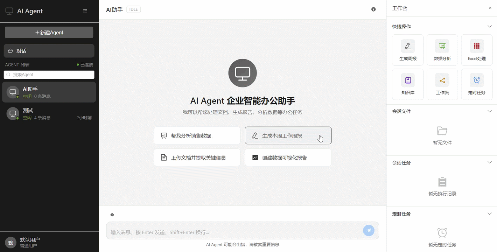

<p align="center">
  <h1 align="center">🤖 Office Work Agent Harness</h1>
  <p align="center">
    <em>Enterprise Intelligent Office Assistant with Harness Engineering Architecture</em>
  </p>
  <p align="center">
    <a href="https://www.java.com/en/download/help/whatis_java.html">
      
    </a>
    <a href="https://spring.io/projects/spring-boot">
      
    </a>
    <a href="https://vuejs.org/">
      
    </a>
    <a href="https://element-plus.org/">
      
    </a>
    <a href="https://www.docker.com/">
      
    </a>
  </p>
  <p align="center">
    <a href="https://milvus.io/">
      
    </a>
    <a href="https://www.elastic.co/elasticsearch">
      
    </a>
    <a href="https://min.io/">
      
    </a>
    <a href="https://rocketmq.apache.org/">
      
    </a>
    <a href="https://redis.io/">
      
    </a>
  </p>
</p>

<p align="center">
  
</p>

## ✨ Features

### 🧠 ReAct Reasoning Engine

- **Thought-Action-Observation loop** — the agent reasons step by step, calls tools, and observes results iteratively
- **Single action per round** — each ReAct round calls one tool; document tools pack multiple operations via `actions` array
- **Task list management** — automatically decomposes complex tasks and tracks progress
- **Workflow engine** — define and execute multi-step automated workflows with DAG node graph
- **Scheduled tasks** — create recurring or one-time scheduled tasks with flexible repeat rules (ONCE/HOURLY/DAILY/WEEKLY/MONTHLY/YEARLY)
- **Skill system** — load domain-specific skill documents (Word/Excel) to guide document generation with professional formatting

### 💾 Three-Layer Memory System

- **Procedural Memory** — stores the Agent's behavioral patterns and operational knowledge, including system prompts, skill documents, workflow definitions, task execution rules, and current time awareness. This layer shapes _how_ the Agent thinks and acts
- **Short-Term Memory** — maintains recent dialogue history with **AOF (Append-Only File) Rewrite** mechanism: raw conversation records (user interactions, AI thoughts, tool actions/results) are reorganized per retrieval — merging action-result pairs by round, deduplicating file operations (keeping only the latest write per file), and truncating to a configurable round limit — ensuring compact, relevant context without redundant noise
- **Long-Term Memory** — preserves persistent knowledge through two complementary structures:
  - **Effective Conversations** — the most recent N high-quality dialogue segments (user requests and AI responses) that remain directly useful for ongoing context
  - **Historical Summaries** — older conversations compressed via dual-mode LLM summarization: _incremental compression_ appends new summary fragments as conversations grow, while _full compression_ rewrites the entire summary when token count exceeds the threshold, ensuring the summary stays coherent and bounded

### 🔧 MCP Tool System

| Tool               | Description                                                                                                                                         |
| ------------------ | --------------------------------------------------------------------------------------------------------------------------------------------------- |
| **Word**           | Create/modify Word documents — paragraphs, tables, styles, headers/footers, images, watermarks, TOC, and 39+ operations via `actions` array         |
| **Excel**          | Create/modify Excel spreadsheets — cells, formulas, styles, charts, data validation, conditional formatting, and 30+ operations via `actions` array |
| **PDF Read**       | Extract text and tables from PDF files                                                                                                              |
| **Chart**          | Generate data visualization charts (bar, line, pie, scatter, area)                                                                                  |
| **Knowledge Base** | Upload and query documents with vector similarity search (Milvus)                                                                                   |

### 📡 Real-time Communication

- **SSE (Server-Sent Events)** — real-time streaming of AI thoughts, tool calls, and results to the frontend
- **Workflow visualization** — live node status updates during workflow execution
- **Task progress** — real-time task list updates as the agent works

## 🏗️ Architecture

```
┌─────────────┐     SSE      ┌──────────────────┐
│   Vue 3 UI  │◄────────────►│   Spring Boot    │
│  Element+   │   REST/SSE   │   Agent Core     │
└─────────────┘              │                  │
                             │  ┌────────────┐  │
                             │  │ ReAct Loop │  │
                             │  │ Think→Act  │  │
                             │  │ →Observe   │  │
                             │  └─────┬──────┘  │
                             │        │         │
                             │  ┌─────▼──────┐  │
                             │  │ MCP Tools  │  │
                             │  │ System Tool│  │
                             │  └─────┬──────┘  │
                             │        │         │
                             │  ┌─────▼──────┐  │
                             │  │  Memory    │  │
                             │  │ P/S/L Layer│  │
                             │  └────────────┘  │
                             └────────┬─────────┘
                                      │
                    ┌─────────────────┼─────────────────┐
                    │                 │                   │
              ┌─────▼────┐    ┌──────▼─────┐    ┌──────▼─────┐
              │  MySQL   │    │   Milvus   │    │   MinIO    │
              │  Redis   │    │    ES      │    │ RocketMQ   │
              └──────────┘    └────────────┘    └────────────┘
```

## 🚀 Quick Start

### Docker Compose (Recommended)

```bash
# Clone the repository
git clone https://github.com/your-username/agent-service.git
cd agent-service

# Configure environment variables
cd docker
cp .env.example .env
# Edit .env and fill in your API keys

# Start all services
docker compose up -d

# Access the application
# Frontend: http://localhost:8080
# Backend API: http://localhost:8081
```

<details>
<summary>🐳 Troubleshooting: Image Pull Failures</summary>

If you encounter image pull failures due to network issues, use the provided script to pull images manually:

```bash
cd docker
powershell -ExecutionPolicy Bypass -File pull-images.ps1
```

**Or pull images manually:**

```bash
# Configure Docker mirror (Docker Desktop -> Settings -> Docker Engine)
{
  "registry-mirrors": [
    "https://docker.mirrors.ustc.edu.cn",
    "https://hub-mirror.c.163.com",
    "https://mirror.baidubce.com"
  ]
}
```

</details>

### Local Development

**Prerequisites:**

- JDK 17+
- Node.js 20+
- MySQL 8.0, Redis 7, Elasticsearch 8, Milvus 2.4, MinIO, RocketMQ 5

**Backend:**

```bash
# Initialize database
mysql -u root -p < sql/agent_service.sql

# Configure application.properties (copy from example)
cp agent-core/src/main/resources/application.properties.example \
   agent-core/src/main/resources/application.properties

# Build and run
mvn clean package -DskipTests
java -jar agent-core/target/agent-core-1.0.0-SNAPSHOT.jar
```

**Frontend:**

```bash
cd agent-ui
npm install
npm run dev
# Access at http://localhost:3000
```

## ⚙️ Configuration

Key environment variables for Docker deployment:

| Variable            | Description               | Default                                    |
| ------------------- | ------------------------- | ------------------------------------------ |
| `DEEPSEEK_API_KEY`  | DeepSeek LLM API key      | `your-api-key`                             |
| `DEEPSEEK_BASE_URL` | LLM API base URL          | `https://api.deepseek.com`                 |
| `DEEPSEEK_MODEL`    | LLM model name            | `deepseek-chat`                            |
| `EMBEDDING_API_KEY` | Embedding service API key | `your-api-key`                             |
| `EMBEDDING_API_URL` | Embedding service URL     | `https://api.siliconflow.cn/v1/embeddings` |
| `EMBEDDING_MODEL`   | Embedding model name      | `Qwen/Qwen3-Embedding-4B`                  |

For local development, edit `agent-core/src/main/resources/application.properties`.

## 📁 Project Structure

```
agent-service/
├── agent-core/            # Spring Boot backend — ReAct engine, MCP tools, memory layer
├── agent-ui/              # Vue 3 frontend — chat UI, workflow editor, file manager
├── agent-common/          # Shared modules (common-core, common-api, common-util)
├── skills/                # AI skill documents (Word/Excel domain knowledge)
├── sql/                   # Database initialization scripts
├── docker/                # Docker Compose & Dockerfiles
│   ├── docker-compose.yml
│   ├── agent-core/
│   │   ├── Dockerfile
│   │   └── application-docker.properties
│   ├── agent-ui/
│   │   ├── Dockerfile
│   │   └── nginx.conf
│   └── rocketmq/
│       └── broker.conf
├── assets/                # Demo images and GIFs
└── docs/                  # Documentation
```

## 🛠️ Tech Stack

**Backend:**

- [Spring Boot 3.2](https://spring.io/projects/spring-boot) — Application framework
- [MyBatis-Plus](https://baomidou.com/) — ORM framework
- [Apache POI](https://poi.apache.org/) — Word/Excel document processing
- [Spring AI](https://spring.io/projects/spring-ai) — AI integration framework
- [Milvus](https://milvus.io/) — Vector database for semantic search
- [Elasticsearch](https://www.elastic.co/) — Full-text search & vector storage
- [MinIO](https://min.io/) — Object storage for file management
- [RocketMQ](https://rocketmq.apache.org/) — Message queue for async tasks
- [Redis](https://redis.io/) — Caching & session storage

**Frontend:**

- [Vue 3](https://vuejs.org/) — Progressive JavaScript framework
- [Element Plus](https://element-plus.org/) — UI component library
- [Vue Flow](https://vue-flow.dev/) — Workflow DAG visualization
- [Vite](https://vitejs.dev/) — Build tool
- [Pinia](https://pinia.vuejs.org/) — State management

## 📍 Roadmap

### v1.0.0 (Current)

- ReAct reasoning engine with Thought-Action-Observation loop
- Three-layer memory system (Procedural / Short-Term AOF / Long-Term Summary)
- MCP tools: Word (39+ actions), Excel (30+ actions), PDF Read, Chart, Knowledge Base
- System tools: file management, workflow CRUD/execution, scheduled tasks, ask_user, knowledge base query
- Real-time SSE communication with workflow visualization
- Skill system for domain-specific document generation guidance

### v1.1.0 (Planned)

- **Redis caching** — hot data caching for sessions, agents, and frequently accessed queries
- **RocketMQ async tasks** — decouple long-running tool executions from the ReAct loop via message-driven processing
- **Elasticsearch long-term memory retrieval** — enable hybrid search (vector + full-text) for long-term memory recall
- **Thread pool managing multi-Agent** — concurrent Agent runtime management with shared thread pool isolation and resource quotas

## 📝 Disclaimer

This is a **learning project** created for educational purposes to explore AI Agent architecture and implementation patterns. While it demonstrates many production-like features, please be aware that:

- The codebase is still evolving and may contain bugs or incomplete implementations
- Some features (Redis caching, RocketMQ async tasks, Elasticsearch retrieval, multi-Agent thread pool) are planned but not yet implemented
- The project prioritizes learning and experimentation over production readiness
- Contributions, feedback, and suggestions are welcome!

## 👨‍💻 Built by

**Ruize Song** — Computer Technology Master's Degree

Backend development engineer with expertise in Java, C++, and Python. Passionate about AI Agent architecture and Harness Engineering patterns.

|           |                             |
| --------- | --------------------------- |
| 💻 GitHub | https://github.com/akml2013 |
| 📧 Email  | akmla8@qq.com               |

---

## 📜 License

This project is licensed under the MIT License.
